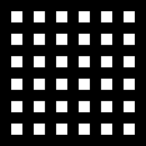
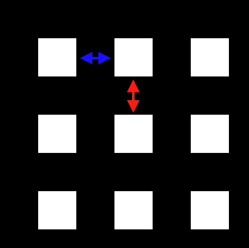
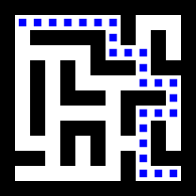
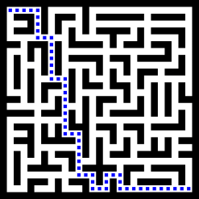
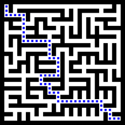
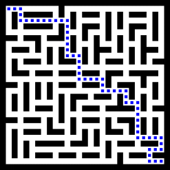

## The Idea

When generating a normal maze, I initialise the grid, set the grid tiles where `x%2 == 0 && y%2 == 0` to white, shuffle a list of the connecting tiles, and then connect them if they would join two conticuous areas of white toghether.

This result in a maze, with a single path from A to B.

> But what if I wanted multiple paths? What if I wanted to join any areas if the path exceeded some sort of threshold.

In this post, I develop and explore this idea, and see if any interesting patterns emerge

## The Foundation

I created a parameterised class called `Arr`, which holds a 2d array of type `T`, with safe ways to access values (returning a default value if out of bounds), plus some functions like `foreach`, `map`, and `init` to iterate, update and set the values given their coordinates.

To initialise the map, as described above
```ts
const arr = new Arr<string>(MAZE_SIZE, MAZE_SIZE, ".");
arr.init((x, y) =>
    (x % 2 == 1 && y % 2 == 1) ? "#" : "."
);
```
I chose to strings to represent the tiles. I got '#' and '.' mixed up pretty early on, so '.' are walls. It doesn't really matter though.



To render the maze, I'm using a canvas and 2D rendering context
```ts
const canvas = document.querySelector("canvas") as HTMLCanvasElement;
const ctx = canvas.getContext("2d") as CanvasRenderingContext2D;
```

I use the `foreach` method of my `Arr` class
```ts
ctx.fillStyle = "orangered";
ctx.fillRect(0, 0, 1000, 1000);
arr.forEach((x, y, v) => {
    ctx.fillStyle = v == "#" ? "white" : "black";
    ctx.fillRect(x * SCALE, y * SCALE, SCALE, SCALE);
});
```

## Pathfinding

Now that I can see my maze, I'll need to write a pathfinding component. While I was testing this, I initialised the maze to be random, with 10% black tiles, so I could test the pathfinding algorithm before I had a complete maze.

I won't go into too much detail, but its basically an optimistic a-star algorithm, though it doesn't *always* find the best path, its good enough for our purposes

I initialise a new empty `Arr` recording the x & y coordinates, distance so far, an estimated cost, and optionally a "parent" for retracing our steps. I also created a list of the same objects that I can sort to find the next tile to evaluate. 

The loop goes as follows
```
WHILE we haven't found the solution, and there's still items in the list, cur = the next item
    IF cur is our target, we've found the solution

    IF cur.dist + cur.estCost > attemptLimit * attemptLimit * 0.5, then quit early

    evaluate the north, south, east and west neighbours

    SORT the list of options
```

When we evaluate a tile
```
IF the tile is in bounds AND currently solid
    IF the tile is in the 'arr' of options already
        IF this is a shorter path
            update the distance & parent to reference the source tile
        ELSE
            add a new option to the list and the 'arr', which includes calculating an estimated remaining distance (the euclidean distance)
```

Once we've completed the loop, if we have found the solution we need to unwind the path. We start at the end, add it to the list, and then jump to that tile's parent until we end up with a reversed path.

## The Maze building

Making the maze can be broken into 3 parts

### 1. Create an array of "options"

Create an array of every tile that bridges any two white tiles, basically `x%2==1 && y%2==0` for horizontal joins, and `x%2==0 && y%2==1` for vertical.
I stored the tiles tothe north & south or east & west in this object too to make life eaiser later on.



### 2. Shuffle

Here's how I shuffle
```ts
for (let i = 0; i < options.length-1; i++) {
    const r = options.length - Math.floor(Math.random() * (options.length - 1))-1;
    const tmp = options[i];
    options[i] = options[r];
    options[r] = tmp;
}
```
I might use a seeded random number generator at some point so I can have maze seeds.

### 3. Walk through the list
For each of the options I use the pathfinding algorithm to determine how far apart they are (if they're connected at all). If they aren't connected, or are farther than the threshold, then I "join" the areas by setting the tile to white.

## The Result

You can see here that there are mutliple solutions to the maze, adn there isn't anywhere within the maze where you would need to backtack too much. This maze shows a flaw in the "good enough" pathfinding algorithm.



We can create a bigger maze:



And we can increase the threshold, to make it harder to get around:



Or decrease it to make it easier:

